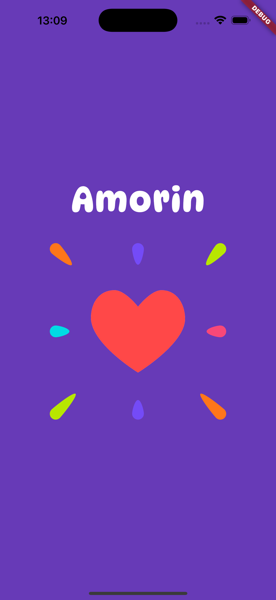
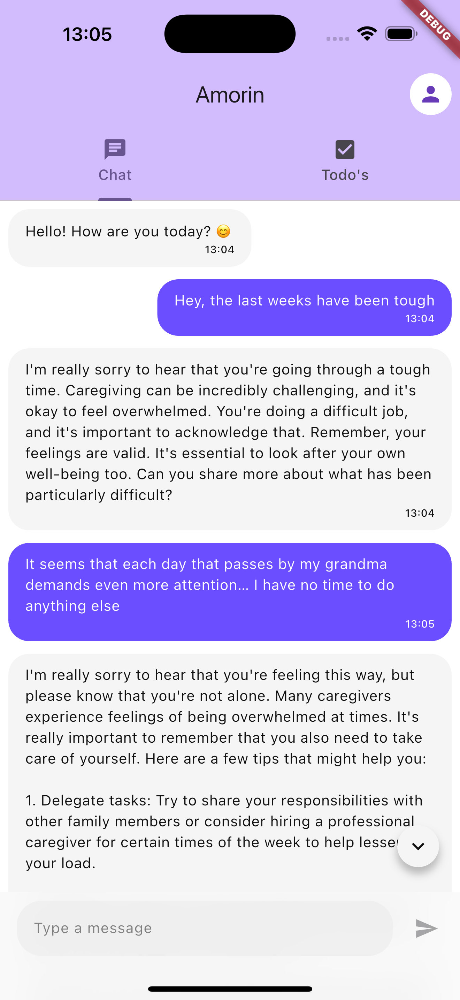
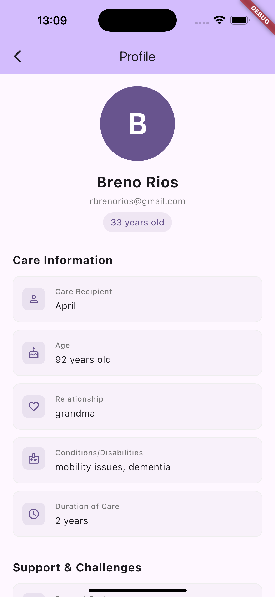

# Amorin 💜

A Flutter-based companion app designed specifically for caregivers who dedicate their lives to caring for others. Amorin combines AI-powered emotional support with self-care tracking to help caregivers maintain their own well-being while caring for loved ones.

## 📱 Screenshots

<p align="center">
  
  
  
  
</p>

## 🎯 Purpose

Caregiving is one of the most selfless roles someone can take on, but it often comes at a personal cost. Caregivers frequently:

- Put everyone else's needs before their own
- Feel isolated with no one to talk to about their struggles
- Lose track of their own self-care in the midst of caring for others
- Feel guilty about taking time for themselves

**Amorin was created to be the companion caregivers deserve.** It provides:

- **A listening ear**: An empathetic AI companion available 24/7 to listen, support, and understand
- **Self-care accountability**: Track how much you're doing for yourself vs. others
- **Gentle reminders**: Visual feedback encouraging you to prioritize your own well-being
- **No judgment**: A safe space to express feelings without guilt or pressure

## ✨ Features

### 💬 Your Personal Companion

- AI-powered chat assistant that's always there to listen
- Empathetic responses tailored for caregivers' unique challenges
- A judgment-free space to share your thoughts and feelings
- Available anytime, day or night, when you need someone to talk to

### 📝 Self-Care Tracking

- Create and manage daily tasks with a special "for me" marker
- Real-time percentage showing how many completed tasks were for yourself
- Visual encouragement to balance caregiving with self-care
- Simple, stress-free interface designed for busy schedules

### 🎨 Calming Design

- Soothing colors and elegant typography
- Gentle Lottie animations
- Clean, distraction-free interface
- Thoughtfully designed for moments of peace in a hectic day

## 🚀 Getting Started

### Prerequisites

- Flutter SDK (version 3.10.1 or higher)
- Dart SDK
- iOS development: Xcode and CocoaPods
- Android development: Android Studio
- An OpenAI API key

### Installation

1. **Clone the repository**

   ```bash
   git clone https://github.com/rbrenor2/amorin.git
   cd amorin
   ```

2. **Install dependencies**

   ```bash
   flutter pub get
   ```

3. **Set up your environment variables**

   Create a `.env` file in the root directory:

   ```bash
   touch .env
   ```

   Add your OpenAI API key to the `.env` file:

   ```
   OPENAI_API_KEY=your-api-key-here
   ```

   > ⚠️ Never commit your `.env` file to version control. It's already in `.gitignore`.

4. **Add assets**

   Place your Lottie animation file at:

   ```
   assets/lottie/heart.json
   ```

   You can find free Lottie animations at [lottiefiles.com](https://lottiefiles.com)

5. **Install iOS dependencies** (iOS only)
   ```bash
   cd ios
   pod install
   cd ..
   ```

### Running the App

**On iOS Simulator/Device:**

```bash
flutter run
```

**On Android Emulator/Device:**

```bash
flutter run
```

**For specific device:**

```bash
flutter devices  # List available devices
flutter run -d <device-id>
```

## 🛠️ Configuration

### Customizing the AI Companion

Edit the system prompt in `lib/prompts/amorin1.prompt.dart` to adjust how the AI companion responds to caregivers' needs.

### Changing the Splash Screen

Replace `assets/lottie/heart.json` with your preferred Lottie animation, or update the splash screen configuration in `lib/pages/splash.page.dart`.

### Modifying the Theme

Update the color scheme in `lib/main.dart` and chat theme in `lib/pages/chat.page.dart`.

## 📁 Project Structure

```
lib/
├── main.dart                 # App entry point
├── pages/
│   ├── main.page.dart       # Tab navigation container
│   ├── chat.page.dart       # AI companion chat interface
│   ├── home.page.dart       # Home tab
│   ├── todos.page.dart      # Self-care task tracking
│   └── splash.page.dart     # Animated splash screen
├── services/
│   └── openai.service.dart  # OpenAI API integration
└── prompts/
    └── amorin1.prompt.dart  # AI companion personality
```

## 🔐 Security Notes

- Your OpenAI API key is stored locally in the `.env` file
- Never share or commit your API key
- The `.env` file is automatically ignored by git
- Consider using a backend proxy in production to secure your API key

## 💝 For Caregivers

If you're a caregiver using Amorin:

- **You deserve care too**: Taking care of yourself isn't selfish—it's necessary
- **Talk openly**: Your AI companion is here to listen without judgment
- **Track your wins**: Even small acts of self-care matter and should be celebrated
- **You're not alone**: While caring for others is isolating, you have a companion here

## 🤝 Contributing

Contributions are welcome! Please feel free to submit a Pull Request.

## 📄 License

This project is open source and available under the MIT License.

## 💡 Future Enhancements

- [ ] Data persistence (local storage/cloud sync)
- [ ] Weekly/monthly self-care insights
- [ ] Caregiver-specific affirmations and encouragement
- [ ] Reminders for self-care activities
- [ ] Community features to connect caregivers
- [ ] Crisis support resources
- [ ] Mood tracking over time

---

Built with 💜 for caregivers everywhere by Breno Renor

_"You cannot pour from an empty cup. Take care of yourself first."_
